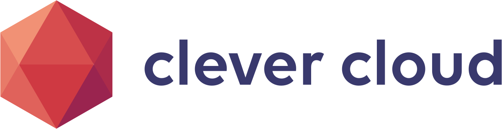

# Deploy a Celery + Gunicorn application on Clever Cloud
[](https://clever-cloud.com)

This is an example of how to deploy a Python web application that offloads
long-running work to background tasks, using [Celery](https://docs.celeryq.dev/)
for the task queue and [Gunicorn](https://gunicorn.org/) as the WSGI server, on
Clever Cloud.

The application is a small text-processing service. The web process accepts a
request, hands the work to Celery, and immediately returns a task ID. A separate
Celery worker processes the task in the background (with a simulated delay), and
the result can be fetched later using that task ID. [Redis](https://redis.io/)
is used as the Celery broker and result backend.

## How it works

Clever Cloud's [Python runtime](https://www.clever-cloud.com/developers/doc/applications/python/)
runs a WSGI application with Gunicorn. The deployment is driven by three
environment variables:

- **`CC_PYTHON_BACKEND=gunicorn`** tells the runtime to serve the app with Gunicorn.
- **`CC_PYTHON_MODULE=app:server`** points Gunicorn at the `server` WSGI callable in `app.py`.
- **`CC_PRE_RUN_HOOK="bash workers.sh"`** runs `workers.sh` before the web server starts.

`workers.sh` starts the Celery worker (and a local Redis instance, unless a
Redis add-on is linked) in the background, so the web process and the worker run
side by side in the same instance:

- If a **Redis add-on** is linked, Clever Cloud exposes a `REDIS_URL`
  environment variable; both the app and the worker use it, and no local Redis
  is started.
- Otherwise, the example is **self-contained**: `workers.sh` boots a local
  `redis-server` and Celery connects to `redis://localhost:6379/0`.

## Project structure

```
.
├── app.py              # WSGI app (server) + the Celery task (process_text)
├── workers.sh          # CC_PRE_RUN_HOOK: starts Redis (if needed) + the Celery worker
├── requirements.txt    # Python dependencies (celery, gunicorn, redis)
└── assets/             # README assets
```

## Technology stack

- [Celery 5.6](https://docs.celeryq.dev/) - Distributed task queue
- [Gunicorn 26](https://gunicorn.org/) - Python WSGI HTTP server
- [redis-py 8](https://redis.readthedocs.io/) - Redis client (broker and result backend)
- Python 3.12+

## Deployment steps

To deploy this application, you need a [Clever Cloud account](https://console.clever-cloud.com)
and [Clever Tools](https://github.com/CleverCloud/clever-tools), the Clever Cloud CLI:

```bash
npm i -g clever-tools
clever login
```

You can also install Clever Tools with [many package managers](https://www.clever-cloud.com/developers/doc/cli/install/).

```bash
# Step 1: Create a Python application
clever create --type python celery-gunicorn-example

# Step 2: Configure the runtime
clever env set CC_PYTHON_BACKEND "gunicorn"
clever env set CC_PYTHON_MODULE "app:server"
clever env set CC_PRE_RUN_HOOK "bash workers.sh"

# Step 3: Deploy
clever deploy
```

And you're done! Once the deployment finishes, open the application in your browser:

```bash
clever open
```

> **Using a Redis add-on (optional):** to use a managed Redis instead of the
> local one, create and link a Redis add-on. It will expose a `REDIS_URL`
> environment variable, which the application picks up automatically:
>
> ```bash
> clever addon create redis-addon redis_kv --link celery-gunicorn-example
> ```

## Usage

Submit some text to process with a GET request:

`https://<your-app-url>/?text=This%20is%20a%20demo`

The response returns a task ID. Fetch the result once the worker is done:

`https://<your-app-url>/?task_id=<the-task-id>`

You can add operations to the request with these parameters:

- `reverse` - reverse the text
- `uppercase` - convert the text to uppercase
- `lowercase` - convert the text to lowercase
- `repeat_count` - repeat the text the given number of times

For example, to reverse the text:

`https://<your-app-url>/?text=Hello%20world!&reverse=true`

You can also combine multiple operations:

`https://<your-app-url>/?text=Hello%20world!&reverse=true&uppercase=true&repeat_count=3`

## Running locally

You need Python 3.12+ and a running Redis instance.

```bash
# Install the dependencies (a virtual environment is recommended)
pip install -r requirements.txt

# Start Redis and the Celery worker in the background
bash workers.sh

# Start the web server
gunicorn app:server --bind 0.0.0.0:8080
```

The application will be accessible at http://localhost:8080.

> By default the app connects to `redis://localhost:6379/0`. Set the `REDIS_URL`
> environment variable to point it at another Redis instance.

## Troubleshooting

If you encounter issues:

1. Check the application logs: `clever logs`
2. Verify all environment variables are correctly set: `clever env`
3. Make sure the Celery worker is running (look for its startup banner in the logs).

## Contributing

Contributions to improve this deployment example are welcome! Please feel free to submit pull requests or open issues for any enhancements or bug fixes.

## License

This example is provided under the terms of the MIT license.
